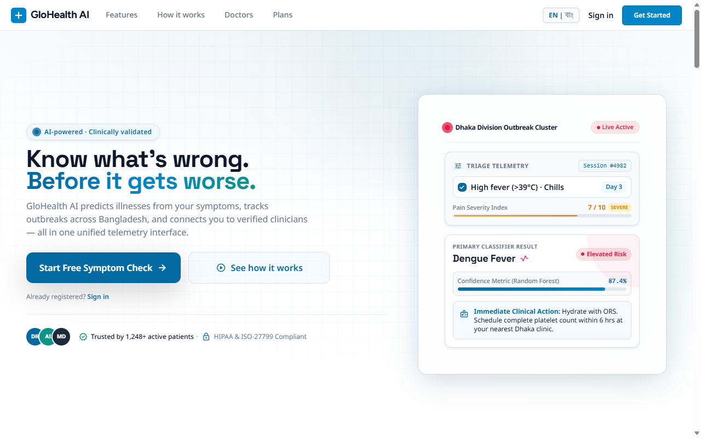
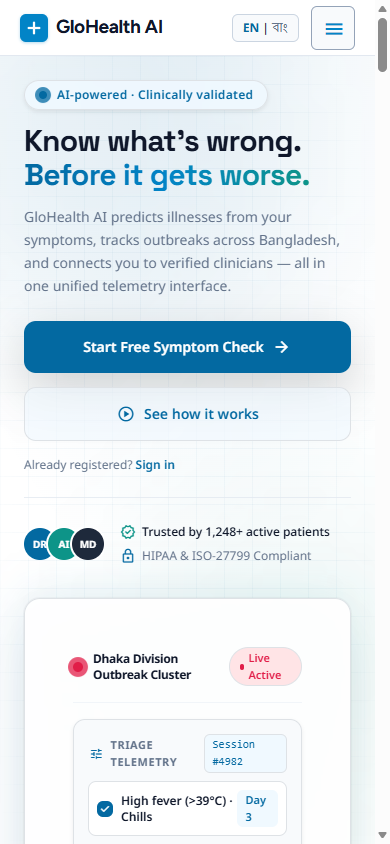
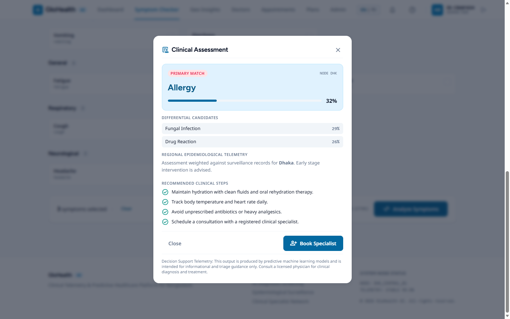
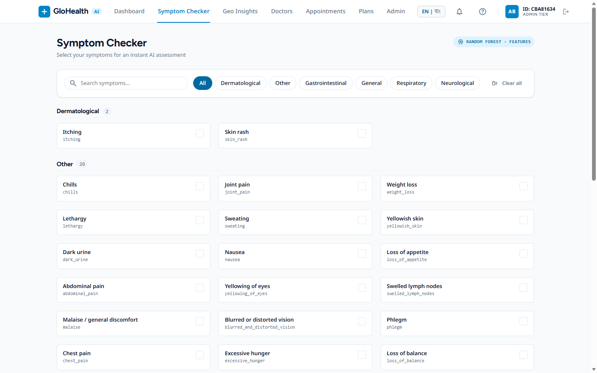
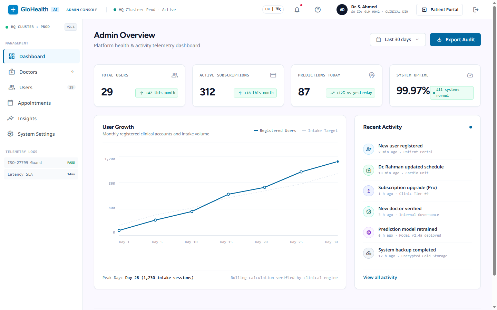
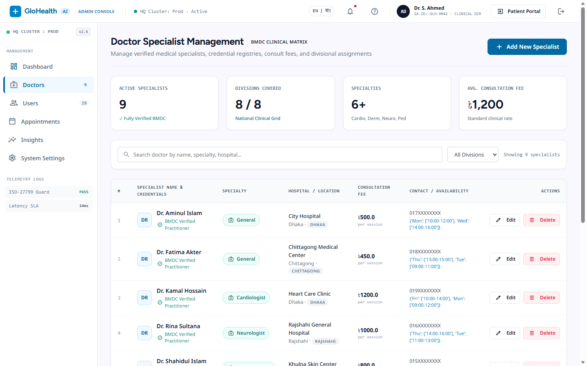
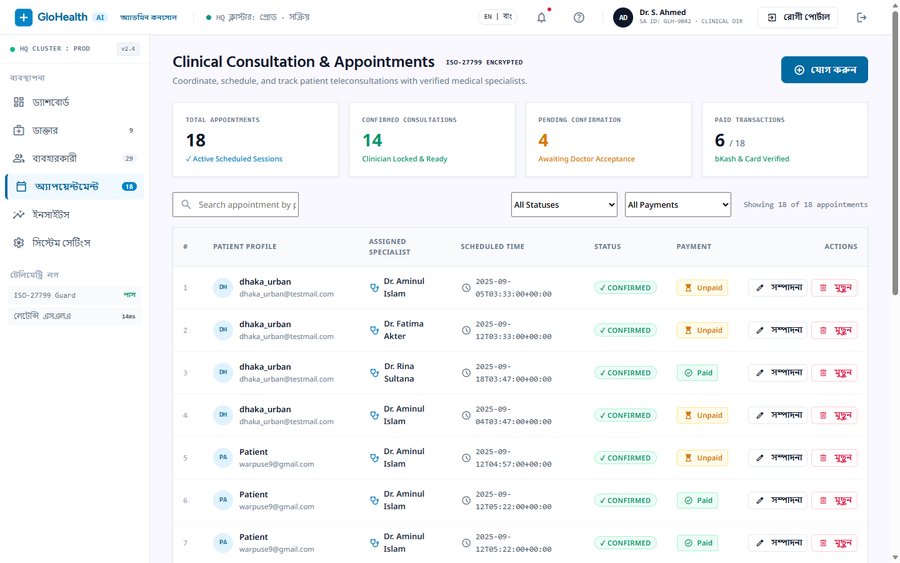
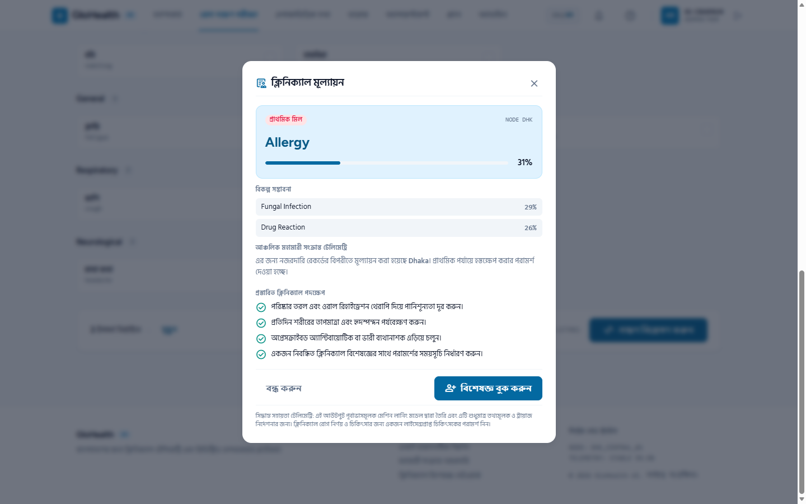
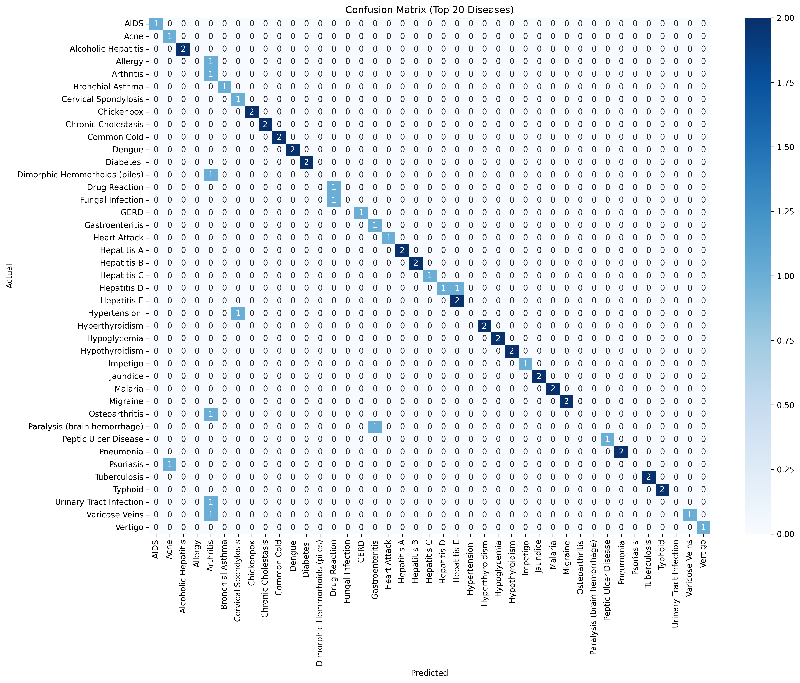
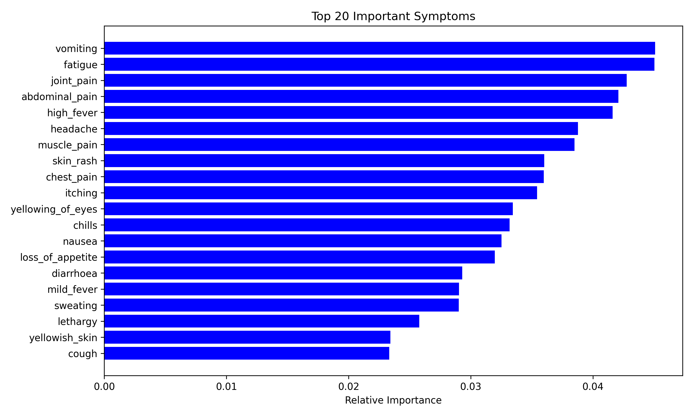

<div align="center">

  

  # GloHealth AI
  ### Intelligent Healthcare Symptom Diagnosis & Epidemiological Surveillance Platform

  [](https://glohealth-ai.onrender.com)
  [](https://github.com/itzabd/GloHealth_Ai/stargazers)
  [](LICENSE)

  <p align="center">
    <a href="https://glohealth-ai.onrender.com"><strong>Explore Live Demo »</strong></a>
    <br />
    <br />
    <a href="#-system-architecture">Architecture</a> •
    <a href="#-features-at-a-glance">Key Features</a> •
    <a href="#-screenshot-gallery">Visual Tour</a> •
    <a href="#-quickstart--installation">Quickstart</a> •
    <a href="#-machine-learning-engine">ML Pipeline</a> •
    <a href="#-api-reference">API Reference</a>
  </p>

  <p>
    
    
    
    
    
    
    
  </p>

</div>

---

> 🌐 **Try the Live Application:** **[https://glohealth-ai.onrender.com](https://glohealth-ai.onrender.com)**  
> Experience real-time symptom diagnosis, regional health insights, doctor scheduling, and the administrative surveillance console.

---

## 📌 Executive Summary

**GloHealth AI** is an enterprise-ready, full-stack healthcare web application that combines machine learning with regional geospatial intelligence to provide rapid symptom-based disease prediction, healthcare resource scheduling, and epidemiological trend tracking.

### Core Objectives:
1. **Patient Empowerment:** Instant, ML-driven health triage with transparent confidence scores and symptom importance breakdowns.
2. **Public Health Intelligence:** Geospatial and temporal disease surveillance across divisions to aid early epidemic detection.
3. **Telehealth Ecosystem:** Integrated scheduling connecting patients with verified medical specialists.
4. **Inclusive Healthcare:** Bilingual support (**English & Bengali**) with a fully responsive mobile-first UI.

---

## 📸 Screenshot Gallery

### 🌐 User Experience (Desktop & Mobile)
| Desktop Landing Experience | Responsive Mobile Experience |
|:---:|:---:|
|  |  |

---

### 🩺 AI Symptom Assessment & Clinical Results
| Interactive Symptom Selector | Diagnostic Risk & Confidence Score |
|:---:|:---:|
|  |  |

---

### 🏥 Healthcare Management & Administrative Surveillance
| Epidemiological Surveillance Overview | Doctor Roster & Specialty Management |
|:---:|:---:|
|  |  |

| Appointment Scheduling & Dispatch | Bilingual Accessibility (Bengali / বাংলা) |
|:---:|:---:|
|  |  |

---

### 📊 Machine Learning Metrics & Explainability
| Model Confusion Matrix | Top Symptom Feature Importance |
|:---:|:---:|
|  |  |

---

## ✨ Features at a Glance

### 👤 Patient & Public Portal
- **AI Symptom Diagnosis:** Select symptoms across categorized clinical groups to receive ranked disease predictions with confidence intervals.
- **Location-Aware Boosting:** Predictions intelligently factor in regional disease prevalence data from Bangladesh divisions.
- **Doctor Discovery & Booking:** Filter healthcare specialists by division, district, hospital, and consultation fee.
- **Subscription Tiers:** Flexible membership plans (**Basic, Premium, Ultimate**) with complimentary consultation credits.
- **Bilingual Interface:** Seamless toggling between English and Bengali across all forms, modals, and assessment dashboards.

### 🛡️ Administrative & Epidemiological Console
- **Disease Surveillance Heatmap:** Real-time spatial tracking of reported symptom clusters and regional prevalence trends.
- **Doctor Credentialing:** Add, verify, and update healthcare provider profiles and schedules.
- **Appointment Dispatch:** Monitor patient bookings, update consultation statuses, and reconcile payment records.
- **User Governance:** Role-based access control (Patient, Doctor, Administrator).
- **System Settings:** Centralized configuration for consultation pricing, emergency hotlines, and platform metadata.

---

## 🏛️ System Architecture

```
┌─────────────────────────────────────────────────────────────────────────────┐
│                             Client Interfaces                               │
│        Desktop Web Browser  │  Mobile Web  │  Bilingual Locale (EN/BN)      │
└──────────────────────────────────────┬──────────────────────────────────────┘
                                       │ HTTPS / REST
┌──────────────────────────────────────▼──────────────────────────────────────┐
│                    Flask 3.1.1 Application Engine                           │
│  ├─ Session Management (Flask-Login)                                        │
│  ├─ RESTful Routing (/prediction, /predict, /doctors, /admin)               │
│  └─ Security & Rate Limiting                                                │
└──────────────────┬───────────────────────────────────┬──────────────────────┘
                   │                                   │
┌──────────────────▼──────────────────┐ ┌──────────────▼──────────────────────┐
│     Machine Learning Pipeline       │ │       Supabase Data Layer           │
│  ├─ Multi-Model Voting Ensemble     │ │  ├─ PostgreSQL Tables               │
│  ├─ Regional Prevalence Boosting    │ │  ├─ Supabase Auth & JWT             │
│  ├─ Feature Importance Explainer    │ │  ├─ Row Level Security (RLS)        │
│  └─ Temporal Trend Analysis         │ │  └─ Real-time Query Engine          │
└─────────────────────────────────────┘ └─────────────────────────────────────┘
```

---

## 🛠️ Technology Stack

| Layer | Technologies |
|---|---|
| **Backend Framework** | Python 3.11+, Flask 3.1.1, Gunicorn |
| **Machine Learning** | scikit-learn, XGBoost, imbalanced-learn (SMOTE), SciPy |
| **Data Processing** | Pandas, NumPy, Joblib |
| **Visualization** | Matplotlib, Seaborn, Folium |
| **Database & Auth** | Supabase (Managed PostgreSQL) with Supabase-py SDK |
| **Frontend** | Semantic HTML5, Vanilla CSS3, Responsive Glassmorphism, JavaScript ES6+ |
| **Testing & QA** | TestSprite E2E Test Suite, Playwright |
| **Deployment** | Render (PaaS) with zero-downtime containerized deploys |

---

## 🚀 Quickstart & Installation

### Prerequisites
- **Python 3.11+** installed ([python.org](https://www.python.org/downloads/))
- **Git** installed ([git-scm.com](https://git-scm.com/))
- A free **Supabase** account ([supabase.com](https://supabase.com/))

### 1. Clone the Repository
```bash
git clone https://github.com/itzabd/GloHealth_Ai.git
cd GloHealth_Ai
```

### 2. Configure Virtual Environment
```bash
# On Windows
python -m venv .venv
.venv\Scripts\activate

# On macOS/Linux
python3 -m venv .venv
source .venv/bin/activate
```

### 3. Install Dependencies
```bash
pip install --upgrade pip
pip install -r requirements.txt
```

### 4. Configure Environment Variables
Copy the template configuration file:
```bash
cp .env.example .env
```
Edit `.env` with your project credentials:
```env
FLASK_SECRET_KEY=your_secure_random_key
SUPABASE_URL=https://your-project-id.supabase.co
SUPABASE_KEY=your_supabase_anon_public_key
PORT=5000
```

### 5. Initialize Database Schema
Run the automated schema provisioning script:
```bash
python supabase_setup.py
```

### 6. Run the Application
```bash
# Development mode
python app.py

# Production mode with Gunicorn
gunicorn app:app --workers 4 --bind 0.0.0.0:5000
```
Open your browser and navigate to: **`http://localhost:5000`**

---

## 🧠 Machine Learning Engine

The GloHealth AI diagnosis pipeline evaluates **6 competitive algorithms** on multidimensional clinical symptom datasets:

| Algorithm | Strengths | Role in Ensemble |
|---|---|---|
| **Random Forest** | High variance resilience, feature ranking | Primary ensemble voting member |
| **XGBoost** | High gradient performance, missing value handling | High-confidence probability booster |
| **Extra Trees** | Fast randomized feature split sampling | Overfitting mitigation |
| **Support Vector Machine (SVM)** | Robust boundary optimization in high dimensions | High-margin decision support |
| **Gradient Boosting** | Sequential error correction | Sensitivity optimization |
| **Logistic Regression** | Linear probability calibration | Baseline comparison & interpretability |

### Addressing Class Imbalance
- **SMOTE (Synthetic Minority Over-sampling Technique)** applied to underrepresented symptom categories to prevent bias toward common ailments.
- **Location-Based Boosting:** Incorporates regional case frequency dynamically via Bayesian weighting to adjust prior probabilities for endemic conditions.

---

## 📡 API Reference

### Health Diagnosis Prediction
`POST /predict`

Computes the highest probability diseases given a set of symptoms and geolocation coordinates.

#### Request Headers
```http
Content-Type: application/json
```

#### Request Body
```json
{
  "symptoms": ["chills", "high_fever", "sweating", "headache", "nausea"],
  "division": "Chittagong",
  "lat": 22.3569,
  "long": 91.7832
}
```

#### Successful Response (`200 OK`)
```json
{
  "success": true,
  "top_prediction": "Malaria",
  "confidence": 0.892,
  "confidence_percentage": "89.2%",
  "regional_influence_applied": true,
  "predictions": [
    {
      "disease": "Malaria",
      "probability": "89.2%",
      "confidence": 0.892
    },
    {
      "disease": "Dengue",
      "probability": "7.4%",
      "confidence": 0.074
    },
    {
      "disease": "Typhoid",
      "probability": "3.4%",
      "confidence": 0.034
    }
  ]
}
```

---

## 🗄️ Database Architecture (Supabase PostgreSQL)

```sql
-- User Profiles & Roles
CREATE TABLE user_profiles (
  id UUID PRIMARY KEY,
  full_name VARCHAR(150),
  email VARCHAR(255) UNIQUE,
  city VARCHAR(100),
  division VARCHAR(100),
  postal_code VARCHAR(20),
  is_admin BOOLEAN DEFAULT FALSE,
  created_at TIMESTAMP WITH TIME ZONE DEFAULT NOW()
);

-- AI Predictions Log
CREATE TABLE predictions (
  id BIGSERIAL PRIMARY KEY,
  user_id UUID REFERENCES user_profiles(id) ON DELETE CASCADE,
  symptoms JSONB,
  top_prediction VARCHAR(150),
  confidence FLOAT,
  full_results JSONB,
  division VARCHAR(100),
  latitude FLOAT,
  longitude FLOAT,
  timestamp TIMESTAMP WITH TIME ZONE DEFAULT NOW()
);

-- Regional Epidemiological Surveillance
CREATE TABLE location_insights (
  id BIGSERIAL PRIMARY KEY,
  division VARCHAR(100),
  disease VARCHAR(150),
  confidence_score FLOAT,
  prevalence_score FLOAT DEFAULT 0.001,
  case_count INTEGER DEFAULT 1,
  latitude FLOAT,
  longitude FLOAT,
  last_updated TIMESTAMP WITH TIME ZONE DEFAULT NOW()
);

-- Healthcare Providers
CREATE TABLE doctors (
  id UUID PRIMARY KEY DEFAULT gen_random_uuid(),
  name VARCHAR(150),
  specialty VARCHAR(100),
  division VARCHAR(100),
  district VARCHAR(100),
  hospital VARCHAR(200),
  consultation_fee DECIMAL(10, 2),
  availability TEXT,
  contact VARCHAR(50),
  created_at TIMESTAMP WITH TIME ZONE DEFAULT NOW()
);

-- Appointments & Consultations
CREATE TABLE appointments (
  id UUID PRIMARY KEY DEFAULT gen_random_uuid(),
  user_id UUID REFERENCES user_profiles(id) ON DELETE CASCADE,
  doctor_id UUID REFERENCES doctors(id) ON DELETE CASCADE,
  scheduled_time TIMESTAMP WITH TIME ZONE,
  status VARCHAR(50) DEFAULT 'pending',
  payment_status VARCHAR(50) DEFAULT 'unpaid',
  created_at TIMESTAMP WITH TIME ZONE DEFAULT NOW()
);
```

---

## 🧪 Automated Testing Suite

The platform includes end-to-end integration and user journey tests created with **TestSprite** and **Playwright**:

```bash
# Run automated test cases
pytest testsprite_tests/
```

| Test Case | Scenario Description |
|---|---|
| `TC001` | Doctor appointment booking workflow |
| `TC002` | User registration and dashboard onboarding |
| `TC003` | Authentication and session validation |
| `TC004` | Multi-symptom selection and AI prediction generation |
| `TC005` | Administrative console surveillance review |
| `TC008` | Healthcare provider onboarding & roster update |
| `TC010` | Doctor specialty filtering and geographic search |
| `TC013` | Regional disease trend visualization |

---

## 📂 Project Structure

```
GloHealth_Ai/
├── .github/                       # GitHub Actions workflows & issue templates
│   ├── ISSUE_TEMPLATE/            # Bug report & feature request forms
│   ├── pull_request_template.md   # Pull request guidelines
│   └── workflows/ci.yml           # Automated lint & syntax CI pipeline
├── config/                        # Dynamic configuration files
│   └── system_settings.json       # Platform-wide runtime settings
├── data/                          # Training & evaluation datasets
│   ├── symbipredict_2022.csv      # Clinical symptom matrix
│   ├── train.csv                  # Partitioned training dataset
│   └── test.csv                   # Partitioned test dataset
├── docs/                          # Project documentation & visual assets
│   └── screenshots/               # Clean screenshot showcase
├── results/                       # Trained ML artifacts & evaluation plots
│   ├── production_model.joblib    # Serialized production classifier
│   ├── label_encoder.joblib       # Disease categorical encoder
│   └── feature_columns.joblib     # Input symptom vector definitions
├── static/                        # Static UI assets
│   ├── css/main.css               # Core design system & responsive styling
│   ├── js/                        # Client-side validation & dynamic interactions
│   └── Logo.png                   # Official GloHealth AI brand logo
├── templates/                     # Jinja2 HTML templates
│   ├── admin_*.html               # Administrative surveillance consoles
│   ├── auth/                      # Authentication views (Login / Signup)
│   ├── base.html                  # Global layout & navigation shell
│   └── landing.html               # Main landing & feature showcase
├── testsprite_tests/              # Automated E2E Playwright test suite
├── .env.example                   # Environment configuration template
├── .gitignore                     # Git ignore rules for clean repo hygiene
├── app.py                         # Flask web application & API routing
├── data_prep.py                   # Data cleaning & preprocessing script
├── disease_predictor.joblib       # Standalone predictor model artifact
├── geo_analysis.py                # Geospatial and regional risk weighting
├── Procfile                       # Process manager for cloud hosting
├── render.yaml                    # Infrastructure-as-code for Render
├── requirements.txt               # Production Python dependencies
├── runtime.txt                    # Python version specification
├── supabase_setup.py              # Supabase database initialization
├── train_model.py                 # Multi-algorithm ML training pipeline
├── CONTRIBUTING.md                # Open-source contribution guide
├── LICENSE                        # MIT Open-Source License
└── SECURITY.md                    # Responsible disclosure & security policy
```

---

## 🤝 Contributing

Contributions make the open-source community a place to learn, inspire, and create. Any contributions you make are **greatly appreciated**.

Please review our **[CONTRIBUTING.md](CONTRIBUTING.md)** and **[SECURITY.md](SECURITY.md)** before submitting pull requests.

1. Fork the Project
2. Create your Feature Branch (`git checkout -b feature/AmazingFeature`)
3. Commit your Changes (`git commit -m 'feat: Add some AmazingFeature'`)
4. Push to the Branch (`git push origin feature/AmazingFeature`)
5. Open a Pull Request

---

## 📄 License

Distributed under the **MIT License**. See **[LICENSE](LICENSE)** for more information.

---

## 👨‍💻 Author & Acknowledgements

**Abdullah Hossien (itzabd)**  
- GitHub: [@itzabd](https://github.com/itzabd)  
- Live Deployment: [glohealth-ai.onrender.com](https://glohealth-ai.onrender.com)  

*Special thanks to all open-source contributors and healthcare researchers who make accessible AI diagnostics possible.*
